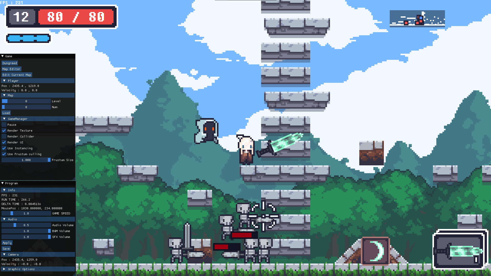
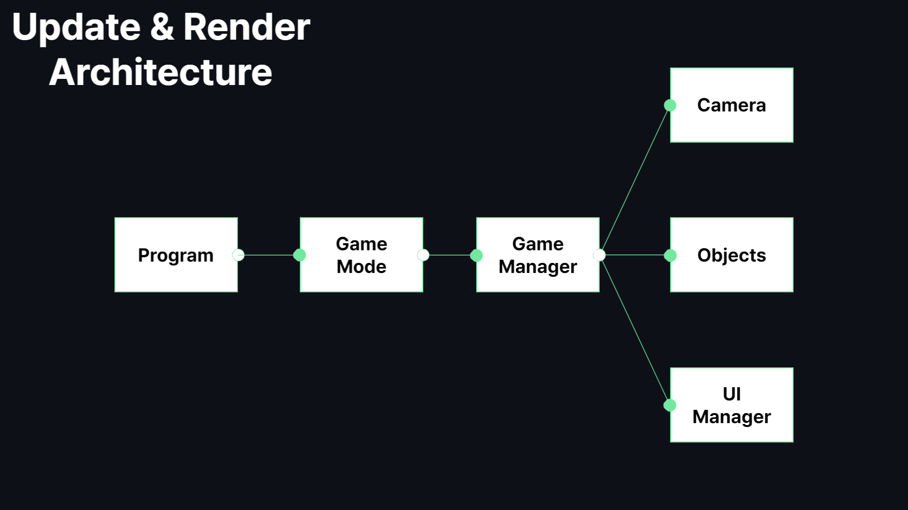

[English Document](https://github.com/BIGSUNGG/DirectX_2D/blob/main/README.md)

<h2>Copy Dungreed 프로젝트</h2>

Copy Dungreed  프로젝트는 [던그리드](https://store.steampowered.com/app/753420/Dungreed/)의 모작입니다.   

[실행 영상](https://youtu.be/sR7eDG6EoLE)

---

<h3>기술 스택</h3>

---

<table align="center">
    <tr align="center">
        <td style="font-weight: bold; padding-right: 10px; vertical-align: center;">
            언어
        </td>
        <td>
                
        </td>
    </tr>
        <tr align="center">
        <td style="font-weight: bold; padding-right: 10px; vertical-align: center;">
        라이브러리
        </td>
        <td>
        
                    
        ImGui
        </td>
    </tr>
</table>

<h2>게임 모드</h2>

<h3>맵 에디터</h3>

맵 에디터는 맵을 수정하기 위한 게임 모드입니다.  
"Save"버튼을 눌러 변경 사항을 저장할 수 있고 "Load"버튼을 눌러 저장된 맵을 불러올 수 있습니다.  
또한 W와 E키를 눌러 오브젝트를 추가할 수 있고   
S와 D키를 눌러 마우스 커서 아래에 있는 오브젝트를 제거할 수도 있습니다.

---

<h3>맵 테스트</h3>

맵 테스트는 여러 맵들을 테스트할 수 있는 게임 모드입니다.  
저장된 맵을 플레이해 볼 수도 있고 "Load"버튼을 눌러 저장된 맵을 불러올 수도 있습니다.

---

<h3>던그리드</h3>

던그리드는 본 게임 모드입니다.
던그리드 모드에 들어갈 때, 맵 매니저에서 랜덤한 던전을 만듭니다.

---

<h2>아키텍쳐</h2>

매 프레임마다 `Program` 클래스에서   
`Update`, `PreRender`, `Render`, `PostRender`, `ImGuiRender`, `RenderEnd` 함수를 순서대로 호출 하고   
위의 사진의 흐름처럼 코드가 실행됩니다.