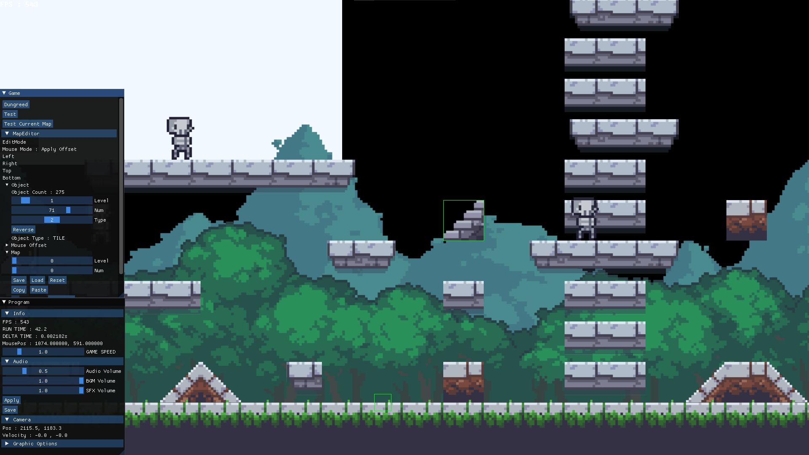
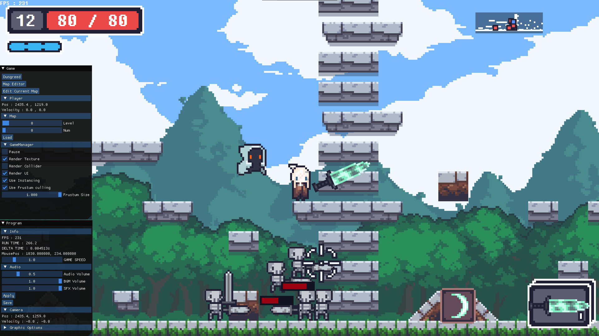
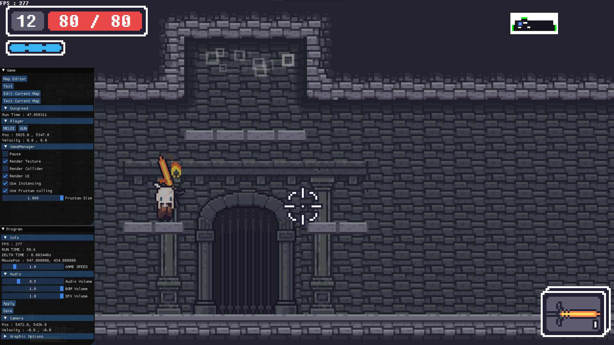
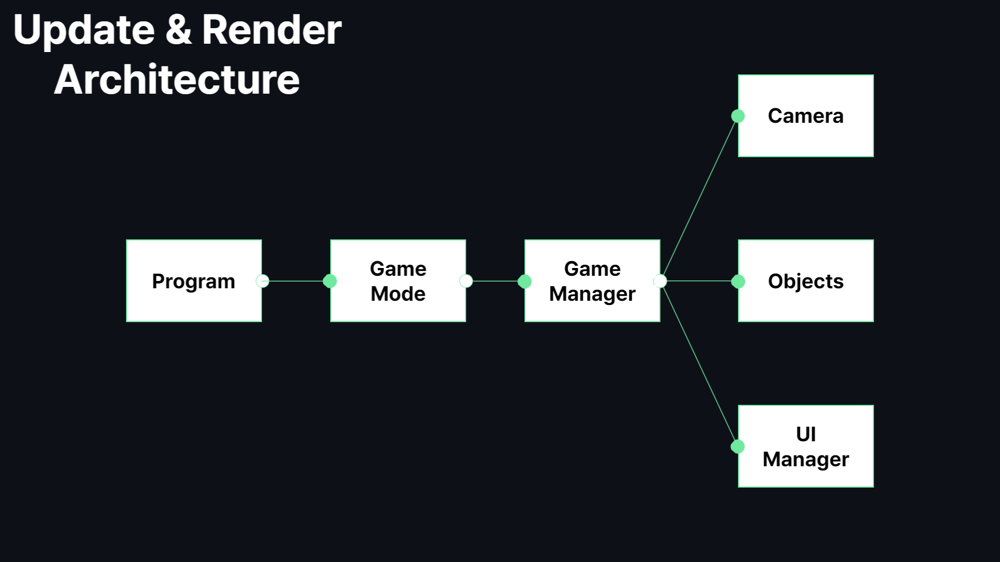

[한국어 문서](https://github.com/BIGSUNGG/DirectX_2D/blob/main/README-ko.md)

<h2>Copy Dungreed Project</h2>

Copy Dungreed  project is replica of [Dungreed](https://store.steampowered.com/app/753420/Dungreed/)  

[Execution Video](https://youtu.be/sR7eDG6EoLE)

---

<h3>Languages and Tools</h3>

---

<table align="center">
    <tr align="center">
        <td style="font-weight: bold; padding-right: 10px; vertical-align: center;">
            Language
        </td>
        <td>
                
        </td>
    </tr>
        <tr align="center">
        <td style="font-weight: bold; padding-right: 10px; vertical-align: center;">
        Library
        </td>
        <td>
        
                    
        ImGui
        </td>
    </tr>
</table>

<h2>Game Mode</h2>

<h3>MapEditor</h3>

MapEditor is a game mode for editing maps.   
You can save changes by pressing "Save" button and load other saved maps  by pressing "Load" button  
Also you can add objects by press "W" or "E" key   
and remove objects under your mouse cursur by press "S" or "D" key.

---

<h3>MapTest</h3>

MapTest is a game mode for testing maps.   
You can play a saved map and load a saved map by pressing the 'Load' button.

---

<h3>Dungreed</h3>

Dungreed is the main game mode.   
When entering this game mode, Map Manager builds a procedurally generated dungeon.

---

<h2>Architecture</h2>

In every frame, the `Program` class calls the   
`Update`, `PreRender`, `Render`, `PostRender`, `ImGuiRender`, `RenderEnd` functions in sequence,   
following the flow shown in the picture above.
